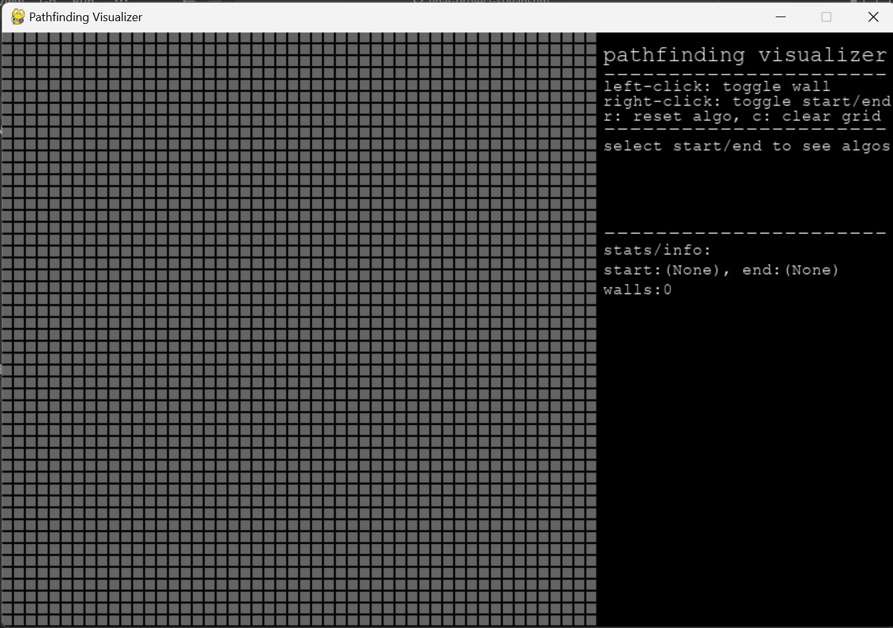
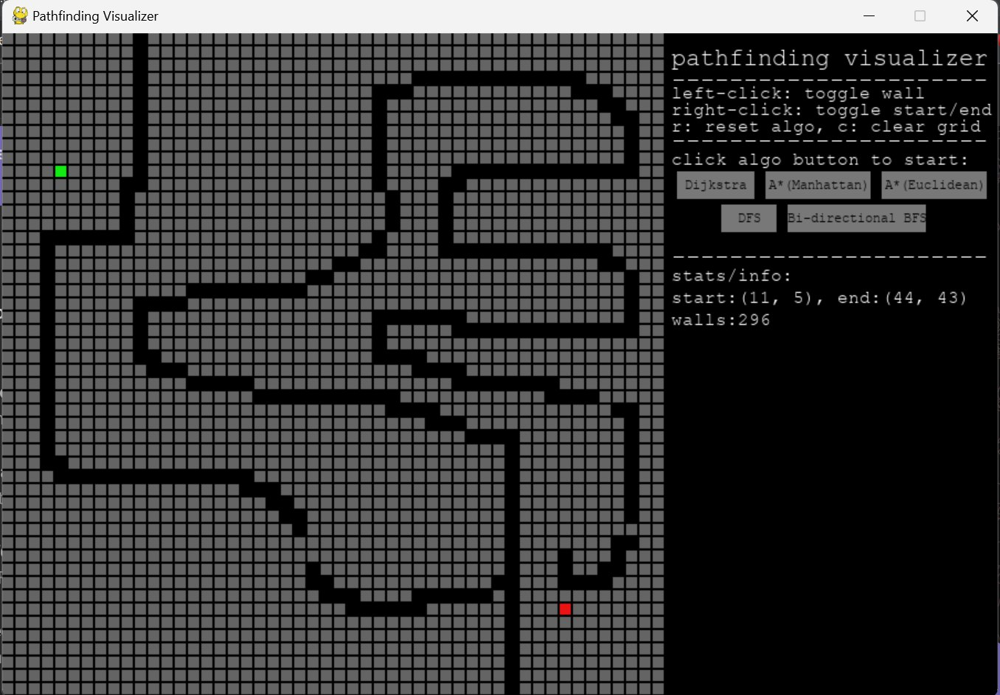
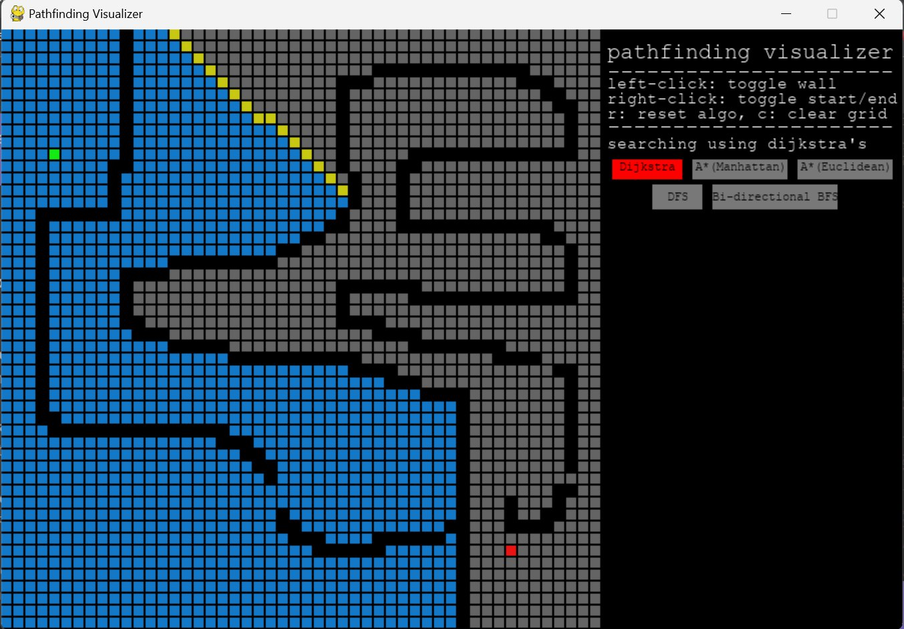
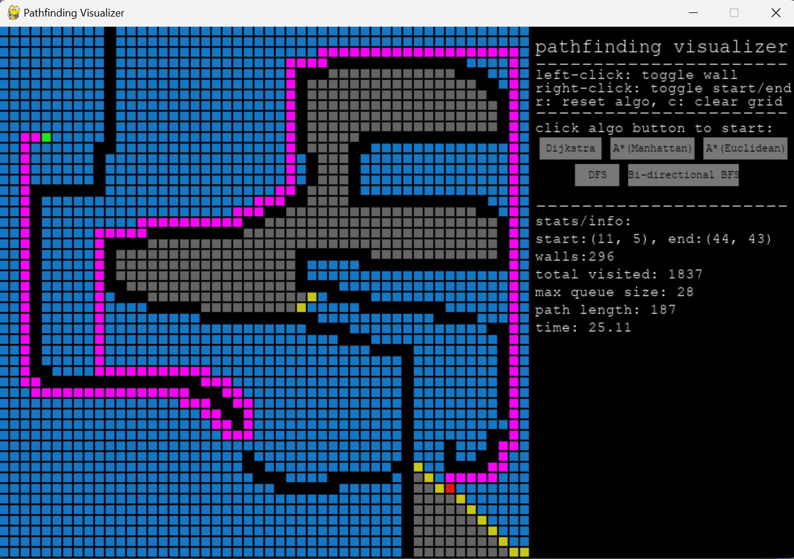

# Pathfinding Visualizer
by Jerry and Suvansh

This project is a visualization tool for various pathfinding algorithms. It allows you to choose an algorithm, set a start and end point, and watch as the algorithm finds the shortest path between the two points.

## How to Use

To use the visualizer, run the `main.py` script. The dependencies are listed in the pyproject.toml file.
Use right click to toggle start and end nodes, in that order. 
Use left click to toggle walls, or left click + drag mouse to set multiple walls. 
Click on the corresponding button to run the the algorithm. 
Click 'R' to reset the algorithm visualization, retaining the start/end nodes and walls. 
Click 'C' to clear the visualization and also the start/end nodes and walls. 

Screenshot of inital window: 

Screenshot after walls and start/end has been set: 

Screenshot in the middle of pathfinding: 

Screenshot of final result after path found:

## Project Structure 

### main.py 

This is the main entry point for the application. Run this script to start the visualizer.

### Algorithms 

This project includes several different pathfinding algorithms, each in its own Python script.

#### djikstra.py 

This script implements Dijkstra's algorithm, a popular algorithm for finding the shortest path in a graph. Dijkstra's algorithm works by assigning a cost to each node, starting with 0 for the initial node and infinity for all others. It then repeatedly selects the node with the smallest cost, updates the costs of its neighbors, and marks it as visited. This process continues until the destination node has been visited. Dijkstra's algorithm is guaranteed to find the shortest path, and its time complexity is O((V+E) log V) where V is the number of vertices and E is the number of edges. We note this time complexity is for an implementation of Djikstra's algorithm with a priority queue to find the node with smallest cost.  In our case, all the weights/costs are the same fixed value across the entire grid. So essentially, a dijkstra implementation reduces down to simply breadth-first search with time complexity O(V+E), we don't even have to use a priority queue since all costs are the same and can use a regular FIFO queue instead. 

#### a_star.py

This script implements the A* algorithm, which is a more efficient algorithm for pathfinding that uses heuristics to guide its search. The A* algorithm works similarly to Dijkstra's algorithm, but in addition to the cost of reaching a node, it also considers an estimate of the cost to reach the destination from that node (the heuristic). This project includes two heuristics: the Manhattan distance, which is the sum of the absolute differences in the x and y coordinates, and the Euclidean distance, which is the square root of the sum of the squares of the differences in the x and y coordinates. The Manhattan heuristic is more suitable when diagonal movement isn't allowed, whereas the Euclidean heuristic is more suitable when we can move diagonally, you can see this visually too by running the two algorithms one after the other and seeing the difference in the path. The A* algorithm is also guaranteed to find the shortest path when usinge   an admissible heuristic (one that never overestimates the true cost), and its time complexity is O((V+E) log V).

#### dfs.py

This script implements depth-first search, a simple algorithm that can find a path in a graph. Depth-first search works by exploring as far as possible along each branch before backtracking. While depth-first search is not guaranteed to find the shortest path, it is useful for exploring complex structures due to its simplicity and low memory requirements. Its time complexity is O(V + E).

#### bidirectional_bfs.py

This script implements bidirectional breadth-first search, an optimized version of the traditional breadth-first search algorithm. Bidirectional breadth-first search works by simultaneously running two breadth-first searches, one from the start node and one from the end node. When the two searches meet, a path has been found. This can significantly reduce the search space and therefore the time complexity, especially in large graphs. However, it's important to note that this algorithm is not guaranteed to find the shortest path in a graph with weighted edges. Its time complexity is O(V + E) where V is the number of vertices and E is the number of edges.

### Components 

#### grid.py

The `grid.py` file contains the `Grid` class, which represents a grid of spots. The grid is implemented as a 2D list of `Spot` objects. The `Grid` class has several methods:

- `__init__(self, rows)`: Initializes a `Grid` object with a 2D list of `Spot` objects. The number of rows and columns in the grid is determined by the `rows` parameter.

- `reset()`: Resets all the attributes of each spot in the grid except walls, start, and target. This method is useful for repeating visualizations with the same grid pattern.

- `clear()`: Clears the grid by resetting all spot attributes to their default values.

- `draw_grid(window)`: Draws the grid on the given window, with each spot colored according to its state. 

- `update_neighbors()`: Updates the neighbors of each spot in the grid based on the current state of the grid. Calls the corresponding spot function for each spot in the grid.

- `num_wall()`: Returns the number of wall spots in the grid, for displaying in stats menu. 

#### spot.py

The `spot.py` file contains the `Spot` class, which represents a single spot or node on the grid. The `Spot` class has several attributes and methods:

- `__init__(self, row, col)`: Initializes a `Spot` object with the given row and column coordinates. It also initializes several other attributes such as `start`, `target`, `wall`, `visited`, `queued`, `path`, `neighbors`, and `previous`.

- `draw_spot(self, window, color)`: Draws the `Spot` on the given window with the specified color. The position of the spot is determined by its row and column attributes.

- `update_neighbors(self, grid)`: Updates the list of neighboring spots for the current spot based on the given grid. A neighbor is considered valid if it is not a wall and is within the bounds of the grid.

### Tests 

The test folder contains individual files for each search algorithm, where we check whether the algorithms are implemented correctly and efficiently. For Dijktra and A*, this is done by comparing our implementation against the built-in implementation using Dijkstar package. For the other two algorithms, the computation was done manually and checked against the algorithm. Edge cases that are tested include no path available and extremely large grid sizes. Call `pytest` in terminal to run the tests. 

## Encountered Challenges 

- Visualizing the algorithms: At first, even after we implemented the algorithms correctly, the visualization itself was choppy and not smooth. This was fixed by redrawing the grid and updating the pygame display every time a single cell's state (and by extension, colour) was changed. 

- Handling user input: Managing the start and end nodes, walls, and running the algorithms based on user interactions was very tricky. Perhaps our UI design choice was flawed, but using the same key to toggle both the start/grid nodes was very annoying when trying to write code to handle edge cases (when one is set but the other isn't etc).

- Button GUI Bugs: There were a lot of issues with implementing the GUI, especially for the buttons. For a very long time, the clicked state of the button, when the algorithm was running would overwrite all the other button GUI. This had to be resolved by the inefficient solution of redrawing all buttons whenever any button was clicked. There was another bug where a user click was registered multiple times, often quickly resetting the 'clicked' toggle before the program had time to send the call to the actual algorithm, this was fixed by changing the design of the button action functions and adding a small time delay to prevent double clicks. Further, figuring out the edge cases of when a button should be accessible to the user or not was very difficult. Eventually we came up with a solution when the buttons would only be rendered when the necessary conditions were fulfilled. 

- Displaying Statistics: First, we implemented the algorithms and their visualization but once it was time to display the statistics, things got a little challenging. Firstly, we had to modify the algorithm to calculate different statistics, store and eventually return these statistics in a dictionary. This was doable, but the hard part was displaying these statistics. It was difficult because there were a lot of bugs in getting the stats dictionary returned from the algorithm eventually to the main loop. We encountered unexpected return types, and had to resort to using hacky fixes where we don't ourselves understand why the bug is there in the first place (this has been mentioned explicitly in code comments wherever necessary). 

